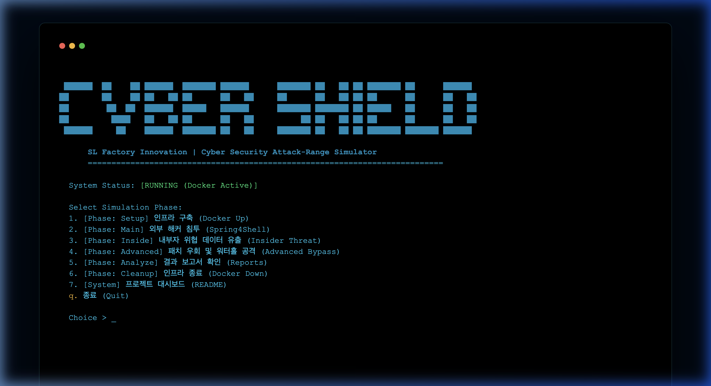
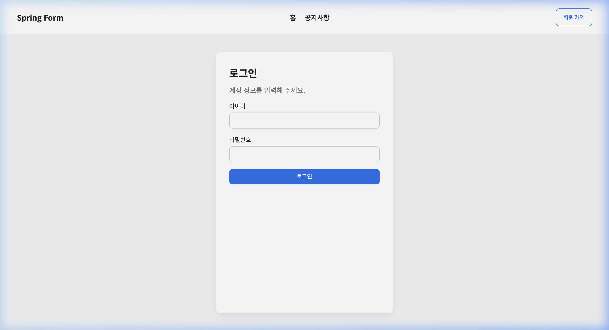
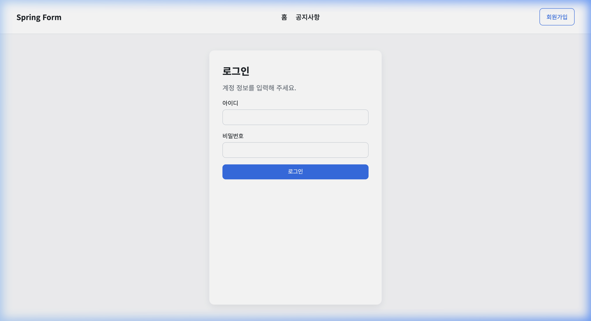
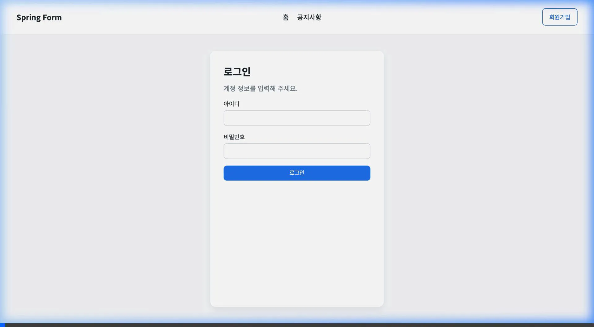
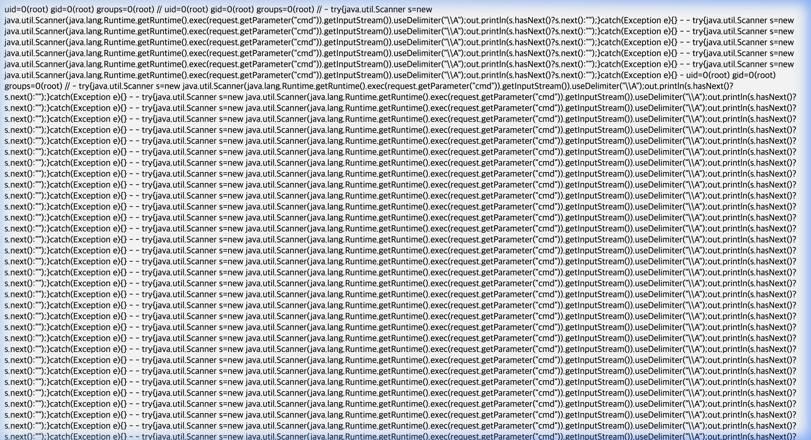
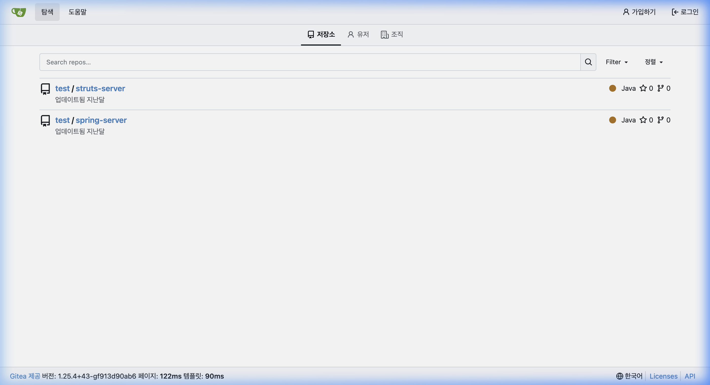
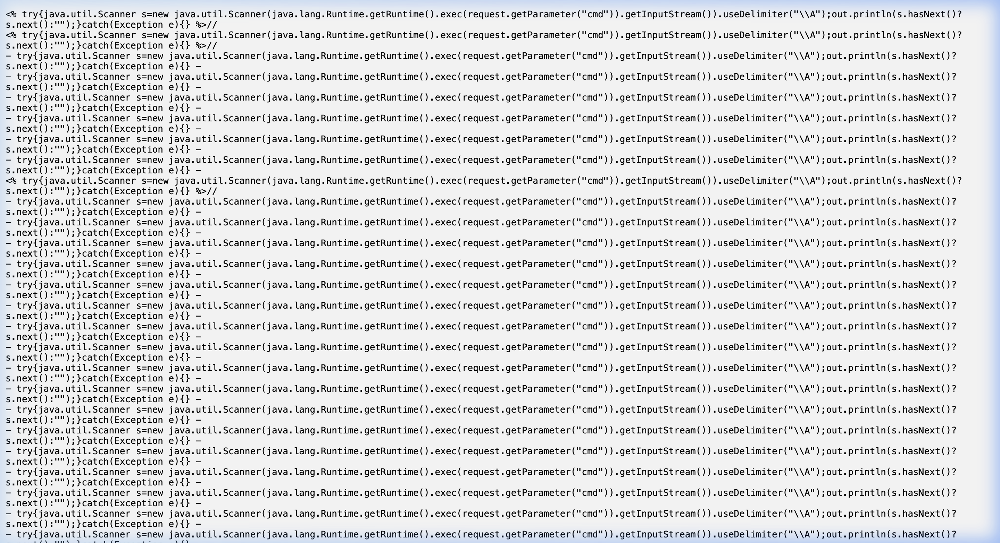

<div align="center">

# SL Cyber-Shield: 스마트 팩토리 위협 시뮬레이션 플랫폼

### [🚀 실시간 보안 보고서 포털 (Demo) 바로가기](https://glory903-devsecops.github.io/sl-cyber-shield/)

#### 모의해킹 자동화 및 포스트 익스플로잇 관제 시스템

   

에스엘(SL) 스마트 팩토리 보안 강화를 위한 최신 제로데이(Spring4Shell) 및 공급망 공격 통합 시뮬레이션 체계입니다.

</div>

---

## ⚡ Quick Start
터미널에서 단 몇 줄의 명령만으로 실제 제조업 타켓 시스템에 대한 보안 시뮬레이션을 시작할 수 있습니다.


*보안 시뮬레이터 통합 제어 센터 (`start_shield.py`)*

```bash
# 1. 저장소 복제
git clone https://github.com/glory903-devsecops/sl-cyber-shield.git
cd sl-cyber-shield

# 2. 통합 시뮬레이터 실행
python3 start_shield.py
```

---

## 🎬 시각적 공격 여정 (Visual Attack Journey: 6-Step)
전문가가 아닌 사람들에게도 보안 위협의 심각성을 전달하기 위해, 공격자의 침투 경로를 6단계 여정으로 시각화했습니다.

### [Phase 1] 초기 침투 및 거점 확보
1. **타겟 정찰 (Reconnaissance)**: 대상 시스템의 노출된 인터페이스와 백엔드 서비스를 스캔하여 잠재적 진입점을 식별합니다.
2. **취약점 식별 (Vulnerability Audit)**: Spring4Shell(CVE-2022-22965) 취약점의 존재 여부를 정밀 프로빙합니다.
3. **RCE 페이로드 주입 (Exploitation)**: 악성 페이로드를 통해 서버 권한을 획득하고 `root` 쉘을 탈취하는 핵심 과정을 재현합니다.

<div align="center">
  
  
  
</div>

### [Phase 2] 권한 상승 및 자산 탈취
4. **권한 상승 및 시스템 장악 (Privilege Escalation)**: 확보된 웹쉘을 통해 `root` 권한을 최종 확인하고 백도어를 심화합니다.
5. **내부망 수평 이동 (Lateral Movement)**: 장악된 서버를 거점으로 빌드 서버(TeamCity) 및 소스코드 저장소를 탐색합니다.
6. **최종 데이터 유출 (Exfiltration)**: 내부 기밀 데이터 및 데이터베이스 자격 증명을 탈취하여 외부로 비인가 유출합니다.

<div align="center">
  
  
  
</div>

> [!TIP]
> **[전체 시네마틱 워크스루 보기](./docs/assets/v2_attack_journey_full.webp)** — 하이라이트 영상으로 침투 전 과정을 한눈에 확인하세요.

---

## 🛡️ 주요 시뮬레이션 시나리오 (Big 3)
`start_shield.py`를 통해 제어되는 세 가지 핵심 위협 모델입니다.

| 시나리오 | 핵심 취약점 (CVE) | 시뮬레이션 목적 |
|:---:|:---|:---|
| **Main Scenario** | Spring4Shell (CVE-2022-22965) | 외부 비인가 사용자의 원격 코드 실행 재현 |
| **Insider Threat** | Credential Leakage | 내부 망 수평 이동 탐지능력 강화 |
| **Advanced Bypass** | Patch Bypass | 보안 설정의 논리적 허점 분석 |

---

> [!CAUTION]
> **본 프로젝트는 교육 및 연구를 목적으로 격리된 Docker 환경에서 구동됩니다.**

<div align="center">
  <sub>에스엘 디지털 트러스트 인프라 보안 솔루션</sub>
</div>
