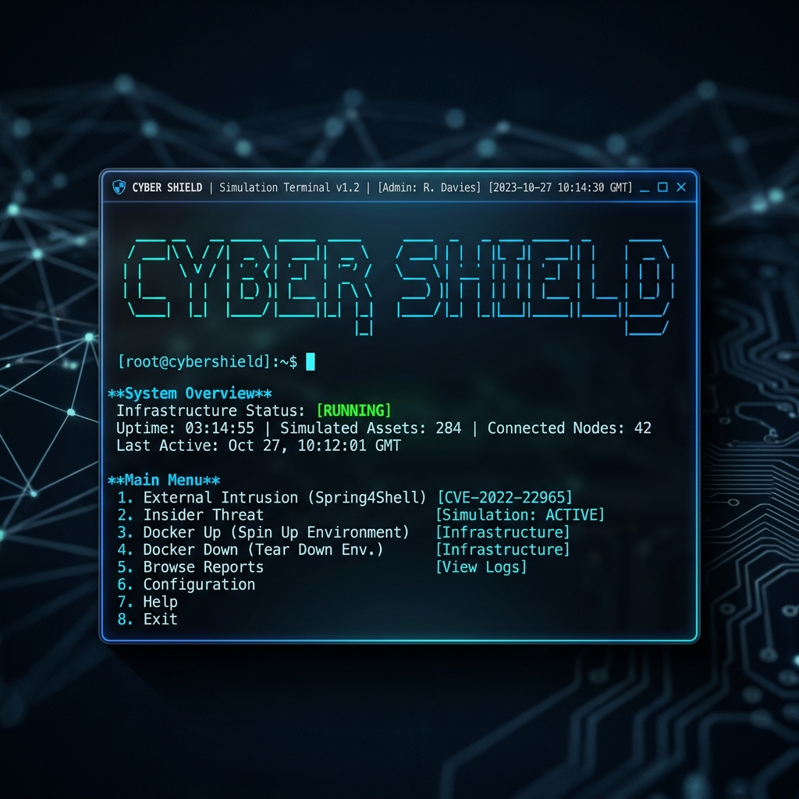
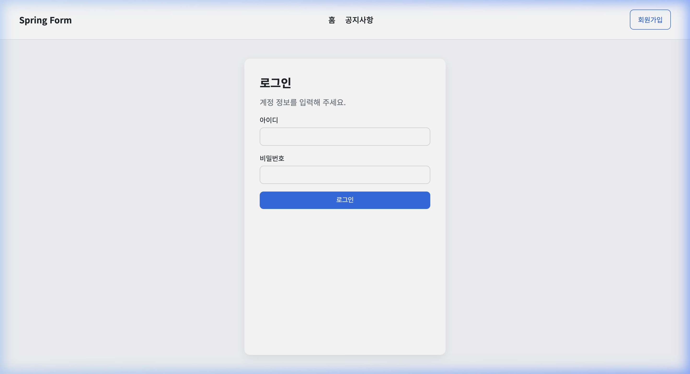
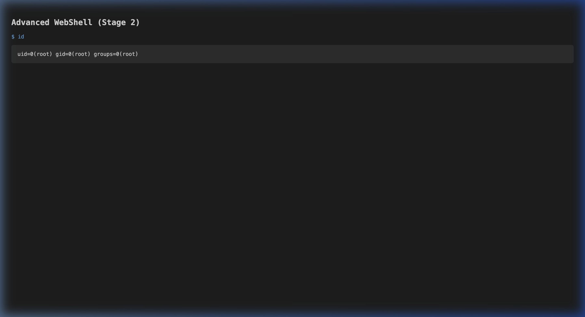
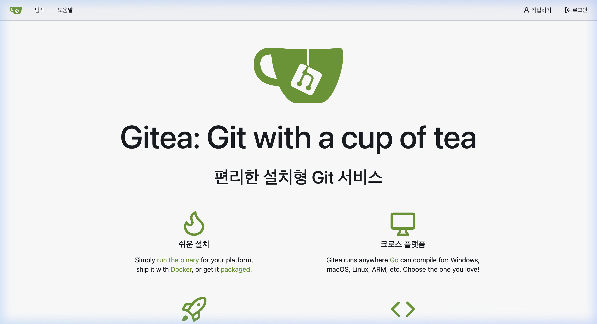
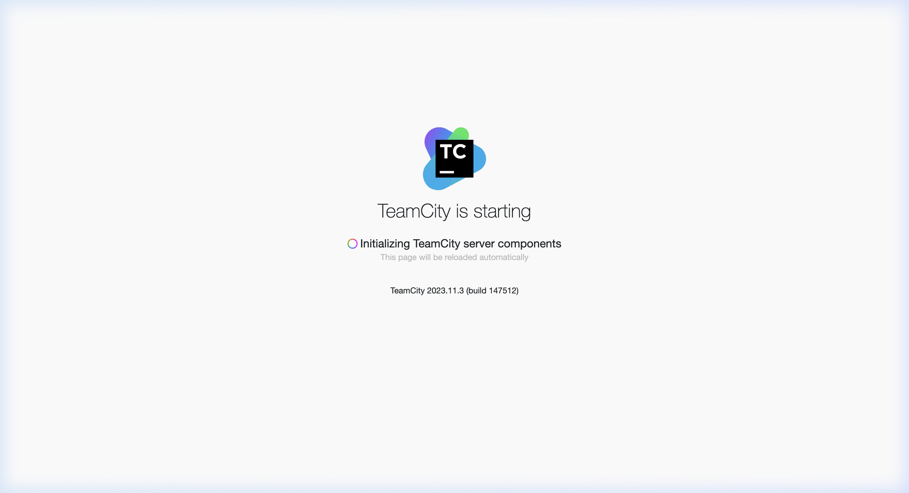

<div align="center">

# 제조업 산업 보안 관점에서 취약점 분석 및 위협 시뮬레이션

### 모의해킹 자동화 및 포스트 익스플로잇 관제 플랫폼
SL Factory Innovation Team | Cyber Security Strategy

Spring | Docker | Python | SL-Blue

에스엘(SL) 스마트 팩토리 보안 강화를 위한 자동화된 취약점 분석 및 위협 시뮬레이션 체계

<br>



<br>

<br>

> 본 플랫폼의 가치: 이 프로젝트는 단순한 해킹 툴이 아닙니다. 에스엘(SL)의 SOC(Security Operations Center) 관점에서 최신 제로데이 취약점(Spring4Shell)과 내부자 위협이 실제 공장 네트워크(OT/IT)에 어떤 치명적인 영향을 주는지 자동으로 시뮬레이션하고 시각화된 리포트를 제공합니다.
> 
> [실시간 보안 보고서 보기 (GitHub Pages)](https://glory903-devsecops.github.io/sl-cyber-shield/)

</div>

---

<br>

<div align="center">
  <h2>주의 사항 (경고)</h2>
</div>

> [!CAUTION]
> **본 프로젝트는 철저히 보안 교육 및 연구 목적으로만 제공됩니다.**
> 제공된 모든 해킹 시나리오는 동봉된 **격리된 로컬 Docker 환경** 내에서만 작동하도록 설계되었습니다.
> 사전 협의 없는 타인의 시스템에 이를 시도하는 것은 정보통신망법 위반으로 엄격히 금지됩니다.

<br>

---

<br>

## 프로젝트 배경 및 산업적 가치

### 1. 대한민국 기업 환경에서의 Spring 프레임워크 위상
대한민국 엔터프라이즈 및 공공 분야에서 자바(Java)와 스프링(Spring) 프레임워크는 '사실상의 표준(De Facto Standard)'입니다. 특히 한국지능정보사회진흥원(NIA)의 **전자정부 표준프레임워크(eGovFrame)**가 스프링 기반으로 구축되어 있어, 국내 기업의 백엔드 시스템 중 압도적인 비중이 스프링 환경에서 작동하고 있습니다.

### 2. Spring4Shell(CVE-2022-22965)의 파급력
2022년 초 발견된 Spring4Shell 취약점은 원격 코드 실행(RCE)이 가능한 치명적인 결함으로, 당시 보안 업계에 Log4Shell에 버금가는 충격적인 위협이었습니다. 특히 인증 없이 서버의 제어권을 탈취할 수 있다는 점에서 국내 주요 대기업 및 금융권 시스템에 비상 대응 체계를 가동하게 만든 핵심 취약점입니다.

### 3. 2026년에도 이 시뮬레이션이 필요한 이유
발견된 지 수년이 지났음에도 불구하고, 국내 제조업 현장의 스마트 팩토리 인프라는 다음과 같은 이유로 여전히 위험에 노출되어 있습니다:
- **레거시 시스템 보존**: 공장 설비 제어와 긴밀히 연결된 구형 서버들은 호환성 문제로 인해 최신 보안 패치 적용이 지연되거나 중단된 경우가 많습니다.
- **하드코딩된 의존성**: 과거 개발된 사내 관리 시스템들이 특정 구형 스프링 버전에 맞춰 하드코딩되어 있어, 프레임워크 업그레이드 자체가 불가능한 상태로 방치된 '보안 사각지대'가 다수 존재합니다.
- **폐쇄망의 역설**: 외부 위협으로부터 안전하다고 믿는 폐쇄망 환경이 오히려 보안 업데이트의 누락을 야기하며, 일단 침투가 발생할 경우 방어 체계가 전무한 실정입니다.

본 플랫폼은 이러한 실제 제조업의 보안 취약점을 기술적으로 재현하고, 이를 효과적으로 방어하기 위한 가시성을 제공합니다.

---

<br>

## 시각적 공격 여정 (Visual Attack Journey)

전문가가 아닌 사람들에게도 보안 위협의 심각성을 전달하기 위해, 웹 UI 상에서의 공격 경로를 시각화했습니다.

| 1. 정상 로그인 페이지 | 2. 취약점 공격 성공 (RCE 웹쉘) |
|:---:|:---:|
|  |  |

| 3. 내부망 도구 노출 (Gitea) | 4. 빌드 시스템 장악 (TeamCity) |
|:---:|:---:|
|  |  |

> [!IMPORTANT]
> **심각성 요약:** 위 이미지는 외부 로그인 페이지의 취약점 하나가 어떻게 서버 전체의 통제권(root 권한) 상실로 이어지고, 나아가 사내 모든 소스코드(Gitea)와 빌드 시스템(TeamCity)까지 노출시키는지 실시간으로 보여줍니다.

<br>

---

## Quick Start (One-Click Simulator)

SL Cyber-Shield는 복잡한 시뮬레이션 환경을 한 번에 제어할 수 있는 통합 러너를 제공합니다.

### 1. 사전 준비 사항 (Prerequisites)

시뮬레이션을 시작하기 전, 아래 도구들이 설치되어 있어야 합니다:

- **Docker Desktop**: 가상 취약점 환경을 구동하는 핵심 엔진입니다.
- **Python 3.8+**: 시뮬레이션 시나리오를 제어하는 통합 러너 언어입니다.

### 2. 원클릭 퀵 마스터 (Quick Start Guide)

터미널(Terminal)에서 단 세 줄의 명령어로 전체 보안 시뮬레이션을 통제할 수 있습니다.

```bash
# 1. 저장소 폴더로 이동
cd sl-cyber-shield

# 2. 통합 러너 실행
python3 start_shield.py
```

### 3. 시나리오 제어 및 분석 워크플로우 (Usage Manual)

`start_shield.py`가 실행되면 아래와 같은 논리적 보안 점검 순서에 따라 메뉴가 제공됩니다:

| 단계 | 메뉴 번호 | 기능 설명 | 기대 효과 |
|:---:|:---:|:---|:---|
| **준비** | **[1]** | **인프라 구축 (Docker Up)** | 시뮬레이션에 필요한 Spring, DB, CI/CD 서버 환경을 자동 생성합니다. |
| **실행** | **[2]** | **외부 해커 침투 (Main Scenario)** | Spring4Shell 취약점을 활용한 실제 RCE 공격 과정을 시뮬레이션합니다. |
| **심화** | **[3]** | **내부자 위협 (Sub Scenario)** | 인증된 내부 사용자의 악의적 행위에 따른 공급망 레이어 침투를 분석합니다. |
| **분석** | **[4]** | **결과 보고서 브라우징** | 공격 성공 지점과 포렌식 증적을 기록한 고품질 HTML 보고서를 생성/확인합니다. |
| **종료** | **[5]** | **인프라 종료 (Docker Down)** | 시뮬레이션 후 모든 가상 환경을 깨끗하게 제거하여 리소스를 회수합니다. |
| **정보** | **[6]** | **프로젝트 대시보드 (README)** | 본 매뉴얼과 기술적 CVE 상세 정보를 확인합니다. |

---

### 4. 상세 설치 가이드 및 트러블슈팅 (Full Manual)

전문적인 실습 환경 구축을 위한 상세 단계입니다.

#### [Step 1] 도커(Docker) 설치
본 시뮬레이터는 컨테이너 기술을 기반으로 합니다.
1. [Docker Desktop](https://www.docker.com/products/docker-desktop/)에 접속하여 본인의 OS에 맞는 설치 파일을 다운로드합니다.
2. 설치 후 **Docker Desktop을 실행**하고, 상태가 'Running'인지 확인합니다.

#### [Step 2] 저장소 복제 및 준비
```bash
git clone https://github.com/glory903-devsecops/sl-cyber-shield.git
cd sl-cyber-shield
```

#### [Step 3] 통합 시뮬레이터 기동
```bash
python3 start_shield.py
```
- **주의**: 만약 `Docker Status: NOT FOUND`가 뜬다면 도커가 실행 중인지 확인하세요.
- **팁**: 인프라 구축(Option 1) 후 약 10~20초 정도 대기하면 모든 서버가 완전히 활성화됩니다.

---

### 최소 명령, 최대 효과 (Impact Efficiency)

- **One-Command Control**: start_shield.py 파일 하나가 수십 개의 복잡한 보안 도구와 인프라 명령어를 대신합니다.
- **Enterprise-Grade Reporting**: 전문가 수준의 HTML 보고서가 자동으로 생성되어, 기술적 성과를 비기술자에게도 매력적으로 전달합니다.
- **Zero-Configuration**: 도커와 파이썬만 있다면 별도의 외부 라이브러리 설치 없이 즉시 구동됩니다.

---

<br>

## 우리는 어떻게 방어해야 할까요? (Mitigation)

공격을 이해했다면 방어할 줄도 알아야 합니다.

1. **라이브러리 패치 (가장 중요)**
   - Spring Framework 버전을 최신으로 업그레이드 하세요. (5.3.18 이상)
2. **비밀번호 하드코딩 금지**
   - 개발 소스코드나 application.properties에 데이터베이스 비밀번호를 평문으로 적어두지 마세요.
3. **내부망 통합 관리의 위험성**
   - 내부 시스템이라고 해서 비밀번호를 대용하면 내부자에게 털립니다.
4. **망 분리와 권한 축소**
   - 일반 직원이 개발용 핵심 데이터베이스나 빌드 서버에 함부로 접근하지 못하게 차단하세요.

<br>

---

<div align="center">
  <sub>Created by SL Factory Innovation Team & AI Assistant | 에스엘 디지털 트러스트 인프라 보안 솔루션</sub>
</div>
