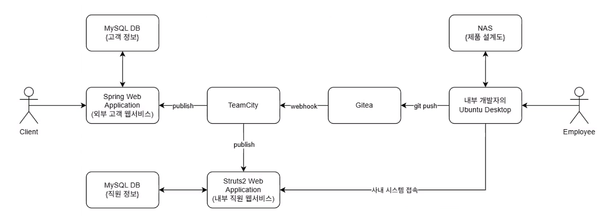

<div align="center">
  
# 🎯 CVE-2022-22965 (Spring4Shell) <br> Advanced Attack Scenarios


**SK쉴더스 이큐스트(EQST) 가이드라인 기반 모의해킹 자동화 및 인프라 보안 진단 실습**

---
</div>

> [!CAUTION]
> **본 프로젝트는 철저히 교육 목적으로만 사용할 수 있습니다.**<br>
> 제공된 모든 해킹 시나리오와 스크립트는 **로컬 격리 환경(Docker)**용으로 설계되었습니다. 타인의 권한 없는 시스템에 이를 테스트하거나 유출하는 것은 정보통신망법 등에 의거하여 엄격히 금지됩니다.

---

## 🚀 빠른 시작 가이드 (Quick Start)

본 프로젝트는 초보자도 원클릭으로 실습 결과를 확인하고, HTML 리포트를 받아볼 수 있는 **2가지의 자동화 스크립트**를 제공합니다.

<details open>
<summary><b>1️⃣ 기존 시나리오: 애플리케이션 취약점 연계 타격 (`run.py`)</b></summary>

> **Spring4Shell 👉 TeamCity 취약점 👉 Struts2 취약점**으로 이어지는 정석적인 제로데이 체인(CVE) 공격 스크립트입니다.
```bash
# 1. 02.AttackScripts 디렉터리로 이동
cd 02.AttackScripts

# 2. 공격 스크립트 실행
python3 run.py
```
</details>

<details open>
<summary><b>2️⃣ 신규 시나리오: 인프라 설정 오류 및 횡적 이동 (`sub_run.py`)</b></summary>

> 취약점을 쓰지 않고 **관리자들의 비밀번호 재사용, 방치된 터널** 등을 파고드는 실무 APT 공격 기법입니다.
```bash
# 서브 시나리오는 최상위 루트 폴더에서 직접 실행합니다.
python3 sub_run.py
```
</details>

> [!TIP]
> 실행이 끝나면 `03.FinalReport` 폴더에 시각화된 **HTML 종합 보고서**가 자동 생성됩니다.

---

## ⚔️ 공격 시나리오 철학 비교

본 프로젝트는 두 가지 접근 철학을 통해 내부망 횡적 이동(Lateral Movement) 시나리오 실습을 지원합니다.

### 1. 소프트웨어 취약점(CVE) 연계형 시나리오 (`run.py`)
기존 모의해킹 컨설팅에서 주로 쓰이는 방식으로, 다수의 제로데이/기타 어플리케이션 취약점을 체인으로 엮어 타겟을 장악합니다.

<div align="center">
  
</div>

### 2. 인프라 설정 오류 및 크리덴셜 탈취형 (`sub_run.py` & `04.SubScenarios/`)
실제 현업 APT 해킹 그룹들이 가장 애용하는 "Living off the Land" 방식입니다. 시스템 버그 대신 컨테이너 인프라 관리자의 사소한 설정 미스를 파고듭니다. (자세한 내용은 `04.SubScenarios/README.md` 참고)

| ⚖️ 구분 | 기존(CVE) 체인 스크립트 (`run.py`) | 신규(Misconfig) 스크립트 (`sub_run.py`) |
|------|-----------------------------------|--------------------------------------|
| **장점** | 고객사에게 화려하고 파급력 높은 보안 위협을 기술적으로 증명할 수 있음. | 보안 장비(IPS/WAF) 탐지 확률이 극히 낮으며, 패치 여부 무관하게 동작함. |
| **단점** | 타겟 소프트웨어(TeamCity 등) 패치 시 해킹 파이프라인이 즉각 무력화됨. | 사전에 인프라 비밀번호 규칙이나 관리자 습관에 대한 내부 정찰(Recon)이 필요함. |

---

## 🛠 아키텍처 및 폴더 구조

```text
CVE-2022-22965/
├── README.md                  # 🌟 메인 가이드 (이 문서)
├── run.py                     # 🚀 원클릭 자동 통합 실행기 (CVE 연계형)
├── sub_run.py                 # 🚀 신규 서브 시나리오 실행기 (Misconfig형)
│
├── 01.TestServer/             # 🐳 테스트용 취약 서버 환경 (Docker Compose)
│
├── 02.AttackScripts/          # ⚙️ 세부 공격 모듈 레이어 (Clean Architecture)
│   ├── stage1_dropper.py      # [SRP] Spring4Shell 페이로드 전송
│   ├── stage2_uploader.py     # [SRP] 웹쉘 배포 자동화
│   ├── stage3_lateral_movement.py # [SRP] 횡적 이동(Lateral Movement) 타격 로직
│   └── health_check.jsp       # 유지보수성을 극대화한 클린 아키텍처 웹쉘
│
├── 03.FinalReport/            # 📊 실습 결과 자동 생성 HTML 보고서 폴더
│
├── 04.SubScenarios/           # 🔥 신규 인프라 설정 취약점 시나리오 가이드
│
└── 99.Legacy/                 # 🕰️ 이전 버전 참고용 팀장님 레거시 코드
```

> [!NOTE]
> **SOLID 및 Clean Architecture 적용** <br>
> 실무 모의해킹 담당자가 작성하는 코드를 가정하여, 파이썬 공격 스크립트는 `Controller`, `UseCase`, `Port`, `Adapter` 계층으로 완전히 분리 설계되었습니다.

---

## 🖥️ 심화 정보: CLI 실시간 모니터링

자동화 스크립트 실행 중 서버 내부에서 어떤 해킹 트래픽이 발생하고 웹쉘이 어떻게 생성되는지 터미널로 실시간 모니터링 할 수 있습니다.

<details>
<summary><b>👀 모니터링 명령어 열기/닫기</b></summary>

1. **스프링 서버 공격 로그 실시간 확인**
   ```bash
   docker logs -f cvepratice-spring-1
   ```

2. **웹쉘 파일 1초 주기로 감시하기**
   ```bash
   docker exec -it cvepratice-spring-1 bash
   watch -n 1 ls -la /usr/local/tomcat/webapps/ROOT/
   ```
</details>

---

## 🛡️ 대응 방안 (Mitigation)

| 중요도 | 조치 방안 | 대상 |
|:---:|:---|:---|
| 🔴 **긴급** | Spring Framework 버전을 `5.3.18` 또는 `5.2.20` 이상으로 업그레이드 | 애플리케이션 개발/운영 파트 |
| 🟠 **경보** | Apache Tomcat 최신 마이너 버전 패치 적용 (9.0.62 이상) | 인프라/미들웨어 파트 |
| 🟡 **주의** | Docker DB/SSH/VNC 패스워드를 기본값(`testtest`, `password`)에서 복잡도 기반으로 변경 | 인프라/DevOps 파트 |

---

<div align="center">
  <sub>Created with 💻 Team EQST & AI Assistant</sub>
</div>
