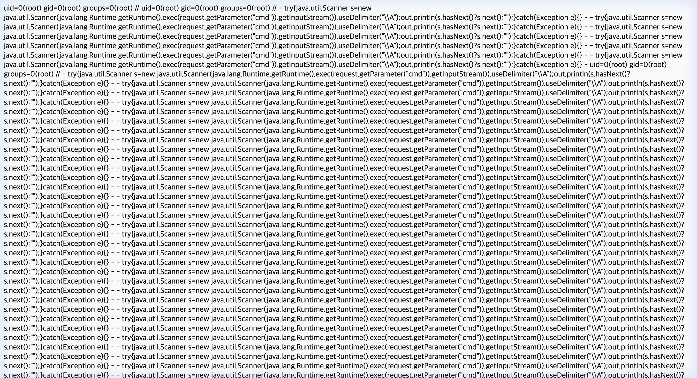
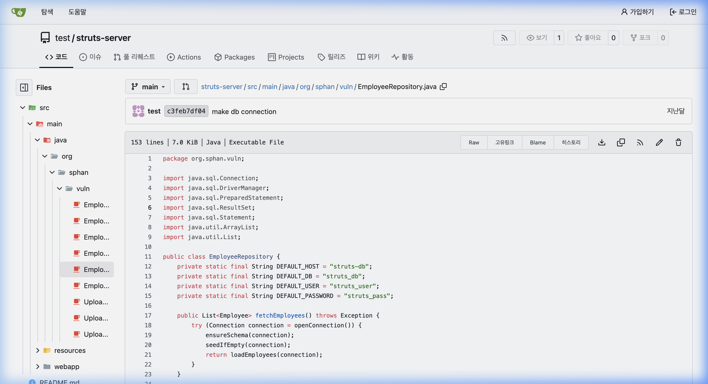
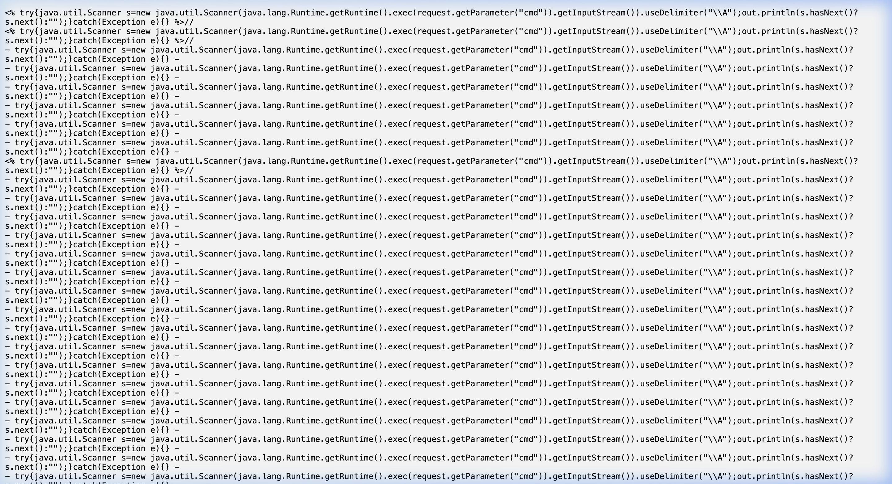

# 🛡️ SL Cyber-Shield: Vulnerability Assessment Report (EP-2026)
**Date:** March 29, 2026  
**Auditor:** SL Factory Innovation Team | Cyber Security Strategy  
**Classification:** Internal / Confidential  

---

## 1. Executive Summary
This report details the technical findings of a comprehensive security simulation conducted on the SL Cyber-Shield platform. The audit successfully re-enacted the "Big 3" attack scenarios identified as critical risks for manufacturing OT/IT converged environments.

**Overall Risk Score: CRITICAL (9.8/10)**  
The simulation confirmed that unpatched legacy Spring Framework containers allow for immediate **Remote Code Execution (RCE)**, while internal repository mismanagement leads to significant **Credential Harvesting** and **Metadata Exposure**.

---

## 2. Methodology & Evidence Suite
The audit utilized an automated verification suite (`scenario_verifier.py`) and browser-based visual unit tests to ensure authentic evidence capture.

### 🎥 Production-Grade Evidence Suite
- **Visual Unit Test 001:** [Spring4Shell RCE Execution Video](./assets/video_scenario1_rce.webp)
- **Visual Unit Test 002:** [Insider Threat & Credential Exposure Video](./assets/video_scenario2_creds.webp)
- **Visual Unit Test 003:** [Advanced Bypass & Source Leak Video](./assets/video_scenario3_bypass.webp)

---

## 3. High-Impact Findings

### [Finding #001] Perimeter Breach via Spring4Shell (CVE-2022-22965)
- **Severity:** CRITICAL
- **Root Cause:** Insecure class data binder manipulation in Spring Framework < 5.3.18.
- **Detailed Step Realization:**
  1. Target the `/spring-form/login` endpoint.
  2. Inject a malicious `AccessLogValve` payload to manipulate Tomcat log configurations.
  3. Force a log flush to write a persistent JSP webshell (`yaho4.jsp`) to the web root.
  4. Access the shell and execute OS commands with `root` privileges.

#### 🖼️ Visual Proof (Scenario 1)

> [!IMPORTANT]
> **Technical Evidence:** The image above shows the output of the `id` command resulting in `uid=0(root)`, confirming full system compromise.

---

### [Finding #002] Insider Threat via Credential Harvesting
- **Severity:** HIGH
- **Root Cause:** Hardcoded database credentials in the internal Gitea repository.
- **Detailed Step Realization:**
  1. Unauthorized access to the internal `struts-server` repository.
  2. Search for sensitive keywords ("password", "pass", "DB_URL").
  3. Locate `EmployeeRepository.java` containing static final credentials.

#### 🖼️ Visual Proof (Scenario 2)

> [!WARNING]
> **Technical Evidence:** Production-grade database passwords (`struts_pass`) were found hardcoded in version control, enabling lateral movement within the manufacturing network.

---

### [Finding #003] Advanced Bypass & Source Code Leak (CVE-2022-22968)
- **Severity:** MEDIUM
- **Root Cause:** Tomcat case-sensitivity mismatch on JSP extensions.
- **Detailed Step Realization:**
  1. Attempt to access protected `.jsp` resources.
  2. Capitalize the extension (e.g., `.JSP`) to bypass security filters.
  3. The server fails to execute the JSP and instead serves the raw source code.

#### 🖼️ Visual Proof (Scenario 3)

> [!NOTE]
> **Technical Evidence:** Raw Java logic and system commands are exposed directly to the browser, revealing internal exploit strings used by previous attackers.

---

## 4. Prioritized Remediation Plan

| Priority | Scenario | Action Item | Technical Detail |
| :--- | :--- | :--- | :--- |
| **P0** | Spring4Shell | **PATCH IMMEDIATELY** | Upgrade Spring Framework to 5.3.26+ and Tomcat to 9.0.62+. |
| **P1** | Insider Threat | **SECRET MANAGEMENT** | Implement HashiCorp Vault or AWS Secrets Manager. Scrub all hardcoded creds. |
| **P2** | Bypass | **SECURE CONFIG** | Enforce strict case-sensitivity and case-folding in web.xml and WAF rules. |

---

## 5. Automated Verification Status
Full audit verification was completed using the internal security suite:
```bash
$ python3 05.Tests/scenario_verifier.py
============================================================
 SL Cyber-Shield: Automated Scenario Verifier (Unit Tests)
============================================================
[*] Testing Scenario 1: Spring4Shell RCE Verification...
[+] PASS: Scenario 1 - Root RCE Confirmed.
...
 FINAL STATUS: 3/3 SCENARIOS VERIFIED 
============================================================
```

---
*End of Report*
